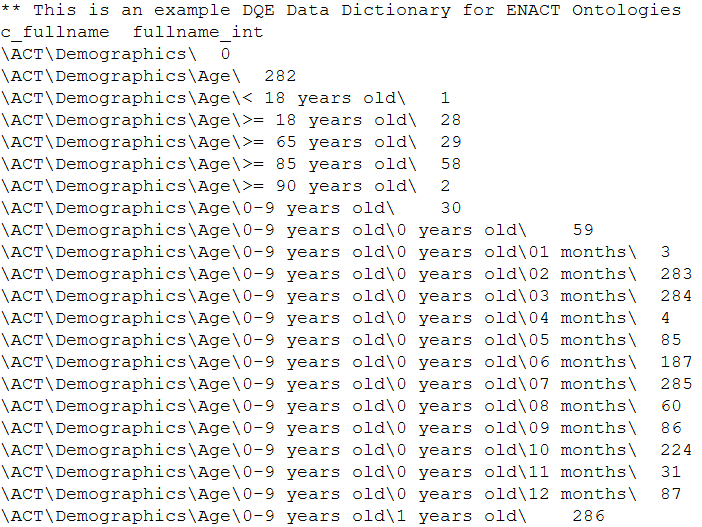
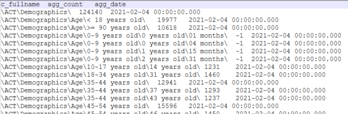

# ENACT-Data-Quality-Explorer

The **ENACT Data Quality Explorer** (DQE) is an interactive visualization web tool for identifying outliers and missing data for sites in a research network. This tool is part of the data quality initiative for the ENACT Network (https://enact-network.us/). It is a web application and it aims to facilitate sites in a network to identify outliers and missing data in their local data as compared to the published statistics of the research network. The outliers and missing data are often data quality issues, often an artifact of the extract-transform-load (ETL) projecess instead of actual problems in the underlying data. However, outliers and missing data are often subtle and not immediately visible to users, making identifying sources of ETL errors challenging. 

DQE helps users see these issues by comparing the percentage of patients associated with a ontology concept at a site to the average percentage from the network. THe idea is that the percentage of patients associated with a ontology concept every element should be similar, within some statistical variation. If your site's percentage for a concept is 2-standard deviations away than the network, then your site is an outlier. This may warrant investigation of the root cause -- missed counting, buggy ETL script, etc.. It is worth nothing that there can be perfectly valid reasons for outliers, such as geographical variations (e.g. increased skin cancer or decreased ski-accidents in warm, sunny states) or specialized healthcare sites (e.g. children's hospitals would have very different disease profiles as compared to cancer centers).

[Full Video Demo of the ENACT Data Quality Explorer (6:27)](https://youtu.be/O1qiLYkIhEs)

[Abridged Version (2:10)](https://www.youtube.com/watch?v=3xECB-U-3-c)

DQE juxtposes a site's data to the network statistics and automatically highlights these outliers. It requires the following pieces of information to function:
1. The network has a set of ontologies and a standard counting methodology.
2. THe network already has site contributions of counts and computes for network statistics.
3. Network statistics are stored in files, one for each ontology, and can be downloaded by DQE.
4. Network provides a data dictionary that contains all concepts across all ontologies.
5. DQE users' local site has completed the counting of data, and the local result file can be opened by DQE.

Here we describe how ENACT fulfills these requirements to help you set up your own instance of DQE for your network:
1. The ENACT network is built on top of [Informatics for Integration Biology & the Bedside (i2b2)](https://www.i2b2.org/). Every site in network shares its obfuscated patient counts via network-wide queries. [i2b2 1.8 and above](https://www.i2b2.org/software/index.html?_gl=1*vwtry7*_ga*MTk5NTAzNzI2NC4xNzMzNTE2NjY1*_ga_ZGEPXGD7XT*MTczOTgwNDk4Mi4xNC4xLjE3Mzk4MDUxOTkuMC4wLjA.) comes with a counting methodology called ["totalnum"](https://community.i2b2.org/wiki/pages/viewpage.action?pageId=83001346), which is the standard counting methodology ENACT uses.
2. The ENACT network collects totalnum from member sites and computes network statistics regularly.
3. The network statistics files (.zip) and hosted by ENACT. The ENACT instance of DQE is authorized to access the files. This is configured in DQE's config.js file.
4. The ENACT network provides a dictionary file (.zip) that contains the all ontologies terms. This dictionary file is also made accessible by the ENACT instance of DQE. Below is a partial screen shot of the data dictionary file for ENACT ontologies. DQE ignores the first two lines. The first line is used for comments and copyright statement. The second line contains headers: c_fullname and fullname_int. c_fullname is the full path of an ontology item. fullname_int is an integer ID for the ontology item. This is configured in DQE's config.js file.

   
  
5. Users would use their browser to visit the ENACT-hosted DQE and use DQE to open their local totalnum file to assess if their ETL might have outliers or missing data. Below is a screen shot of a sample site's totalnum result file. The first line is the header, which contains c_fullname, agg_count, and agg_date. c_fullname is the full path of an ontology item. This is used to match the ontology concept defined in the data dictionary file. agg_count is the obfuscated count of local site for that ontology concept. agg_date is the date the counting occurred. [Documentation](/opt/doc/documentation.html) contains more details on this file.
   
   

