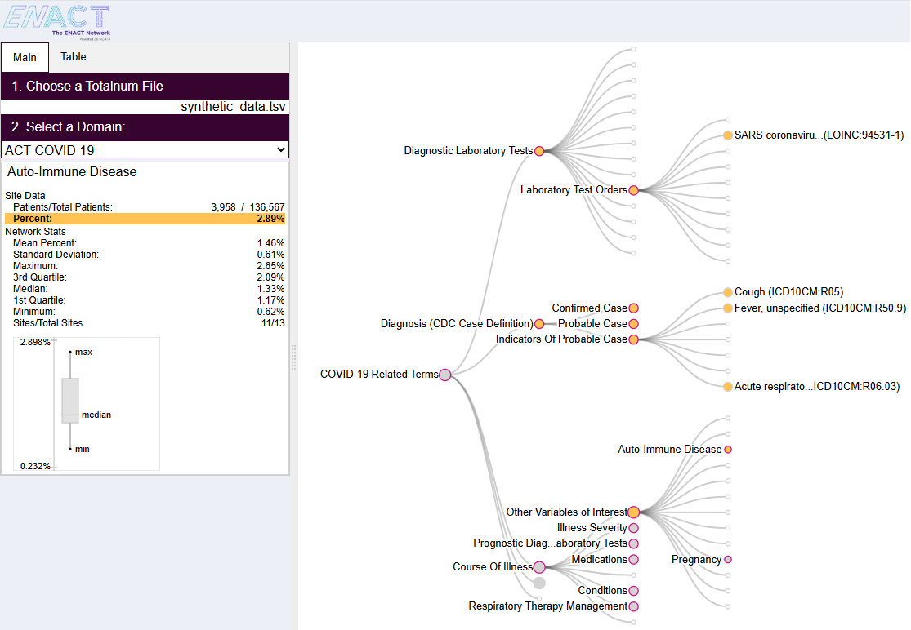

# ENACT-Data-Quality-Explorer

The **ENACT Data Quality Explorer** (DQE) is an interactive visualization web tool for identifying outliers and missing data for sites in a research network. This tool is part of the data quality initiative for the ENACT Network (https://enact-network.us/). It is a web application and it aims to facilitate sites in a network to identify outliers and missing data in their local data as compared to the published statistics of the research network. The outliers and missing data are often data quality issues, often an artifact of the extract-transform-load (ETL) projecess instead of actual problems in the underlying data. However, outliers and missing data are often subtle and not immediately visible to users, especially with large ontologies like ENACT ontologies. 

DQE helps users to see these issues by comparing the percentage of patients associated with a ontology concept at a site to the average percentage from the network. THe idea is that the percentage of patients associated with a ontology concept every element should be similar, within some statistical variation. If your site's percentage is 2-standard deviations away than the network, then it suggests that your site's percentage for that concept is an outlier, which may warrant investigation on the root cause -- missing part of the tree while counting, buggy ETL script, etc.. It is worth nothing that there can be perfectly valid reasons for outliers, such as geographical variations (e.g. skin cancer near sunny states, ski-accidents in colder states) or specialized healthcare sites (e.g. children's hospital would have very different disease profiles as compared to cancer centers).

[Full Video Demo of the ENACT Data Quality Explorer (6:27)](https://youtu.be/O1qiLYkIhEs)

[Abridged Version (2:10)](https://www.youtube.com/watch?v=3xECB-U-3-c)

DQE juxtposes a site's data to the network statistics and automatically highlights outliers. It makes the following assumptions:
1. The network has a set of ontologies and a counting methodology.
2. There exist network statistics files, one for each ontology, where DQE can download from.
3. Users have local site data file it can open.
 
